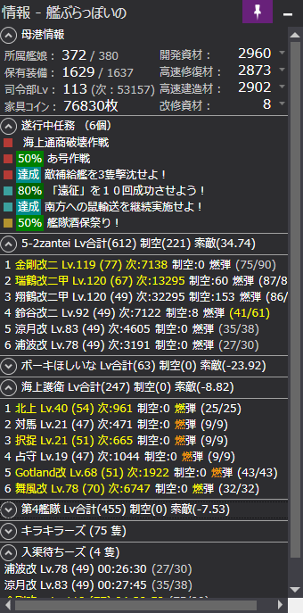

# KanburaLike
艦ぶらっぽい情報表示 提督業プラグイン

### インストール

[リリースフォルダ](https://github.com/reniris/KanburaLike/releases)のKanburaLike.zipを解凍してできた
KanburaLike.dll を KanColleViewer の Plugins ディレクトリに放り込んで下さい。

#### 現在のイメージ

#### 昔撮った艦ぶらのスクショ

### ライセンス

* [The MIT License (MIT)](LICENSE.txt)

MIT ライセンスの下で公開する、オープンソース / フリーソフトウェアです。

### 使用ライブラリ

以下のライブラリを使用しています。

#### [KanColleViewer.Composition](https://github.com/Grabacr07/KanColleViewer)
#### [KanColleViewer.PluginAnalyzer](https://github.com/Grabacr07/KanColleViewer)
#### [KanColleViewer.Controls](https://github.com/Grabacr07/KanColleViewer)
#### [KanColleWrapper](https://github.com/Grabacr07/KanColleViewer)

> The MIT License (MIT)
>
> Copyright (c) 2013 Grabacr07

* **用途 :** プラグイン開発用ライブラリ
* **ライセンス :** The MIT License (MIT)
* **ライセンス全文 :** [LICENSE.txt](https://github.com/Grabacr07/KanColleViewer/blob/develop/LICENSE.txt)

#### [MetroTrilithon.Desktop](https://github.com/Grabacr07/MetroTrilithon)

>The MIT License (MIT)
>
>Copyright (c) 2015 Manato KAMEYA

* **用途 :** プラグイン開発用ライブラリ
* **ライセンス :** The MIT License (MIT)
* **ライセンス全文 :** [LICENSE.txt](https://github.com/Grabacr07/MetroTrilithon/blob/master/LICENSE.txt)

#### [Livet](http://ugaya40.hateblo.jp/entry/Livet)

* **用途 :** MVVM(Model/View/ViewModel)パターン用インフラストラクチャ
* **ライセンス :** zlib/libpng

#### [ほしいものリスト](https://www.amazon.co.jp/hz/wishlist/ls/111ANSVEUB01D?type=wishlist&filter=unpurchased&sort=price-asc)
よかったらなんか買って
